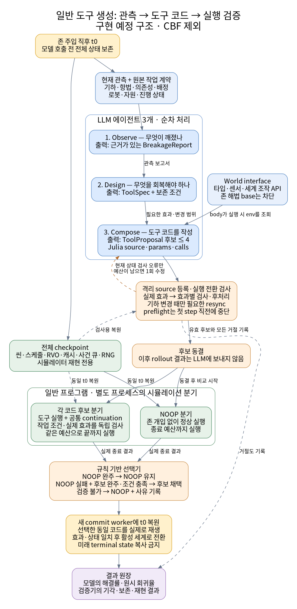

# 일반 도구 생성: 멀티 에이전트 입력과 정보 처리

상태: 구현 예정 구조. 기하 전용 주 경로를 일반 tool generation으로 개정했으며 CBF는 도입하지 않는다.

[실행 계획](../plans/2026-09-24-zone-repair-verification.md) · [설계](2026-09-24-zone-repair-verification-design.md) · [그림 SVG](assets/2026-09-24-zone-repair-information-flow.svg) · [그림 PNG](assets/2026-09-24-zone-repair-information-flow.png)

## 1. 입력은 기하에 한정하지 않는다

모델은 현재의 사건 관측과 원래 수행해야 할 작업을 받는다. 전체 checkpoint는 분기 재현에 쓰고 그대로 LLM에 제공하지 않는다. 미래 사건·난수, NOOP 완주 여부, 성공 seed의 정답, 사람이 쓴 존 복구 해법은 모델 입력에서 제외한다.

| 관측 | 들어가는 정보 | 사용 목적 |
|---|---|---|
| 공간·항법 | 존, blocked goal, 좌표·크기·도달 상태 | 기하/항법 원인 파악 |
| 작업 관계 | 필수 선행조건, 임시 의존성, 운반·조립 관계 | 순서·연결 문제 파악 |
| 로봇·팀·배정 | 가용성, 역할, 팀 구성, task binding | 수행 주체 문제 파악 |
| 자원 | 배터리, 가용 부품·예비 자원, 예약·배송 상태 | 자원 제약과 가능한 상태 전이 파악 |
| 진행 | active/closed, 미완료 작업, 관측된 정체 | 현재 병목 파악 |
| 작업 계약 | 제품·필수 작업·보존 관계·실행 권한 | 바꾸어도 되는 실행 상태와 보존할 의미 구분 |

없는 정보는 unknown이다. 관측 생성기가 해결 목적지나 추천 기전을 계산해 주지 않는다. 필요한 센서가 현재 인터페이스에 있는지 구현 단계에서 확인하고, 추가한다면 동시대 비교 팔에 공통 적용한다.

## 2. 세 에이전트는 일반적인 도구를 설계하고 코드를 만든다

현행 `ObserveEvent → DesignToolSpec → WriteToolImpl`의 역할을 유지한다.

| 단계 | 입력 | 출력 |
|---|---|---|
| Observe | 현재 관측, 물리 원칙, 원본 목표 | BreakageReport: 어떤 조건이 깨졌는지, 근거 ID/측정값, 불확실성 |
| Design | 보고서, 목표, 기존 상위 대응 어휘, 일반 실행 계약 | ToolSpec: 회복할 효과, 사전조건, 보존할 조건 |
| Compose | ToolSpec, 보고서, world types/sensors/state APIs | ToolProposal: 실제 Julia 함수 코드, params, calls |

Design은 원본 전체 관측과 구현 primitive inventory를 직접 받지 않는 기존 분해를 유지한다. Compose의 body는 worker에서 실제 env를 조사하고 필요한 값을 계산한다. 앞선 기하 전용 설계처럼 모델에게 GeometryContext를 따로 전달하고 수치 GeometryPatch만 받는 경로는 주 팔에서 제거한다.

생성 가능한 코드는 센서 읽기, 산술, 조건 분기, 반복, 지역 helper, 허용된 세계 API 조합을 포함한다. 기하 이동, 재배정, 임시 순서 복구, 자원 작업과 그 조합은 예시이며 폐쇄된 기전 메뉴가 아니다. 모델이 전혀 다른 조합을 만들어도 그 효과를 검증할 수 있으면 평가한다.

ToolProposal의 claimed_effects와 self-reported success는 증거가 아니다. 실제로 무엇이 바뀌었는지는 실행기가 측정한다.

## 3. 생성 자유도와 검증 경계

일반 도구 생성은 원래 과제를 마음대로 바꾸는 권한과 다르다.

- 가용 로봇에 작업을 재배정하거나 적법한 임시 의존성을 수정하는 코드는 검사 대상이 될 수 있다.
- 필수 작업을 없애거나, closed를 조작하거나, 존을 지우거나, 비용 없이 자원을 채우는 코드는 거절한다.
- 기하 변경이 있으면 해당 기하·scene 정합성을 검사하고 필요한 resync를 보충한다.
- 배정·스케줄·자원 변경에는 그 상태의 정합성을 검사한다. 모든 도구에 resync를 강제하지 않는다.
- 검증기가 지원하지 못하는 효과는 unsupported로 남긴다. 이를 모델이 문제를 못 풀었다는 결과와 구분한다.

원본 task contract와 채점기는 모델 코드와 분리한다. 전후 diff뿐 아니라 보호된 변경·engine action을 관측/제한하는 신뢰 경계가 필요하다. 별도 프로세스라는 이유만으로 host 부작용이나 scorer 조작까지 차단됐다고 주장하지 않는다.

## 4. 코드 집행부터 최종 선택까지

1. **checkpoint:** 사건 직후 t0의 전체 simulator 상태를 보존한다.
2. **source preflight:** 후보마다 새 worker에서 등록·집행 경계를 검사한다. t0의 현재 상태 오류만 제한된 재작성에 사용할 수 있다.
3. **시간 진행 경계:** 첫 engine step 요청 직전에 preflight를 멈추고 requires_runtime으로 표시한다. 이는 거절이 아니다. 미래를 본 실행 결과를 모델에 보내지 않는다.
4. **후보 동결:** source/params/calls와 제출 순서·거절 기록을 고정한다.
5. **분기 실행:** 동일 checkpoint에서 NOOP와 각 후보를 독립 실행한다. 도구의 정상 step 호출도 trusted engine adapter를 통해 사건·작업 조건·비용·전체 예산을 소비한다. 도구 반환 뒤에는 공통 continuation으로 끝까지 진행한다.
6. **선택:** NOOP가 완주하면 NOOP. NOOP 실패 + 원본 작업 조건을 만족하는 후보 완주면 후보를 선택한다. 인증 불가면 NOOP와 사유를 기록한다.
7. **커밋:** 보존된 원본 세계에 raw code를 eval하지 않는다. 새 commit worker에 같은 checkpoint를 복원하고 동일 코드를 재생한다. 검증 분기와 post-enactment 효과·상태가 일치한 뒤 활성 simulator로 전환한다.
8. **후속 확인:** 같은 continuation의 종료 결과를 확인한다. tool 내부에서 시간을 소비했다면 그 실제 step·사건·비용·로그도 인계한다. 미래 shadow terminal state를 복사하지 않는다.

등록된 Julia 메서드는 table reset으로 없어지지 않으므로 worker 재사용에 의존하지 않는다. commit 실패면 새 worker를 버리고 손대지 않은 원래 worker에서 NOOP로 재개한다. 활성화 이후 trajectory 불일치는 보장 위반으로 남기며 사후 검출이 실패를 없애 준다고 하지 않는다.

## 5. 예산과 실험 팔

기본 호출은 Observe 1회, Design 1회, Compose 1회와 선택적 Compose 수정 1회다. 한 Compose 응답에 여러 완전한 source 후보를 넣을 수 있다. 거절·수정본 포함 총 후보는 최대 4개다. 처음 4개 제출했다면 더 만들지 않고, 처음 3개 제출했다면 남은 1개를 수정 호출로 제출할 수 있다. provider/schema 재시도도 호출 예산에 포함한다.

주 비교는 **U1: 첫 일반 코드 → U4: 최대 4 일반 코드 → V4: U4의 동일 코드에 대한 검증기 선택**이다. 후보 코드를 다시 생성해 선택기 효과와 섞지 않는다. 기하 전용 G4는 보조 비교이며 입력 안내·출력 형식 차이를 명시한다.

원장은 모델의 raw rescue/regression과 실행기의 기각/NOOP 보존을 구분한다. 성공한 4판은 원본 code fixture로 재생하고 비기하 fixture로도 생성·검증 경로가 열려 있는지 시험한다. 사람 fixture의 성공을 모델 성공으로 계산하지 않는다.

보장은 같은 전체 상태·코드 효과·후속 정책·외생 실현·종료 예산이 재현되고 작업 채점이 독립적인 경우에 한정된다. 현재는 이 구조의 설계와 계획을 작성한 상태이며 구현·실험은 아직 실행하지 않았다.
