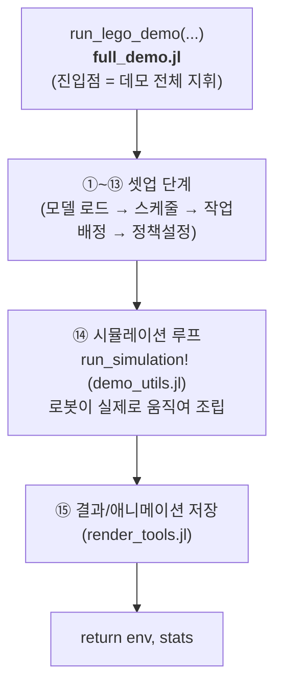
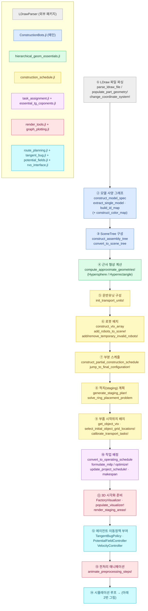
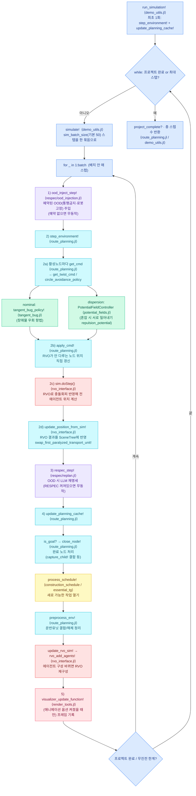

# ConstructionBots 시뮬레이션 실행 흐름 다이어그램

이 문서는 `run_lego_demo(...)` (in [`full_demo.jl`](full_demo.jl)) 를 **한 번** 호출했을 때,
`src/` 안의 각 `.jl` 파일과 그 함수들이 **언제, 어떤 순서로** 사용되는지를 그림으로 정리한 것입니다.

> Mermaid 다이어그램은 VSCode(Markdown Preview Mermaid 확장) 또는 GitHub에서 자동 렌더링됩니다.
> 색 박스 하나 = `.jl` 파일 하나. 박스 안의 항목 = 그 파일에서 호출되는 주요 함수.

---

## 0. 한눈에 보기 — 두 개의 큰 단계



`full_demo.jl` 은 직접 계산을 거의 하지 않습니다. **다른 파일의 함수들을 순서대로 부르는 "지휘자(orchestrator)"** 역할만 합니다.

---

## 1. 셋업 파이프라인 — 어떤 파일이 언제 불리는가

각 단계 번호는 [`full_demo.jl`](full_demo.jl) 주석의 단계 번호와 일치합니다.
화살표 = 실행 순서. 오른쪽 박스 = 그 단계에서 일하는 파일·함수.



> ⑩ 작업 배정은 모드(`assignment_mode`)에 따라:
> - `:greedy` → `GreedyOrderedAssignment` (탐욕, [task_assignment.jl](task_assignment.jl))
> - `:milp` → `SparseAdjacencyMILP` + JuMP 솔버 (정수계획, [essential_tg_coponents.jl](essential_tg_coponents.jl)의 `formulate_milp`)
> - `:milp_w_greedy_warm_start` → greedy 해를 시작점으로 MILP

---

## 2. 시뮬레이션 루프 — 매 스텝 무슨 일이 일어나는가 (⑭의 상세)

여기가 "한 번의 시뮬레이션"의 심장부입니다. 호출 깊이를 들여쓰기로 표현했습니다.



### 매 스텝 흐름을 글로 요약하면

1. **OOD 주입** (`ood_injection.jl`) — 통행금지 구역·로봇 고장 같은 외란을 (예약돼 있으면) 넣음
2. **환경 한 스텝 전진** (`step_environment!`, `route_planning.jl`)
   - **명령 계산** `get_cmd → get_twist_cmd`: 각 로봇이 어디로 갈지 결정
     - 평상시 → **TangentBug** (`tangent_bug.jl`): 적치 원/장애물을 우회
     - 혼잡 시 → **포텐셜장** (`potential_fields.jl`): 로봇끼리 밀어내 분산
   - **명령 적용** `apply_cmd!`: 비-RVO 노드 위치 갱신
   - **RVO 스텝** (`rvo_interface.jl`): 모든 로봇의 충돌 없는 속도/위치를 한꺼번에 계산 → SceneTree 반영
3. **재명세** (`respec_step!`, `replan.jl`) — OOD가 생겼고 RESPEC가 켜져 있으면 LLM에 재계획 요청
4. **계획 캐시 갱신** (`update_planning_cache!`, `route_planning.jl`)
   - 목표 달성한 작업을 **완료** 처리(`close_node!` → 부품 결합 `capture_child!`)
   - 그로 인해 **새로 시작 가능한 작업**을 열고(`process_schedule!`), RVO 재구성
5. **시각화 프레임 기록** (`visualizer_update_function!`, `render_tools.jl`) — 애니메이션 옵션이 켜진 경우만

이 1~5가 한 스텝. `sim_batch_size`(기본 50)스텝마다 메모리를 정리하고, **프로젝트가 완성**되거나 **최대 스텝/무진전 한계**에 도달하면 루프 종료.

---

## 3. 파일별 역할 요약 (한 줄 정리)

| 파일 | 시뮬레이션에서의 역할 | 대표 함수 |
|---|---|---|
| **full_demo.jl** | 진입점 · 전체 파이프라인 지휘 | `run_lego_demo` |
| **demo_utils.jl** | 시뮬 루프 바깥 껍데기(배치 실행·진행률) | `run_simulation!`, `simulate!` |
| **ConstructionBots.jl** | 모델 사양/조립 트리/SceneTree 생성 | `construct_model_spec`, `construct_assembly_tree`, `convert_to_scene_tree` |
| **hierarchical_geom_essentials.jl** | 3D 좌표변환 · 근사 형상(구/직육면체) | `compute_approximate_geometries!`, `global_transform` |
| **essential_tg_coponents.jl** | 그래프 노드/스케줄 자료구조 · MILP 정식화 | `formulate_milp`, `update_planning_cache!`(저수준) |
| **graph_utils_essentials.jl** | 범용 그래프(노드/엣지/탐색) 기반 유틸 | `add_node!`, `get_node`, BFS/DFS |
| **construction_schedule.jl** | 조립 작업 순서 그래프 · 적치/운반 계획 | `construct_partial_construction_schedule`, `generate_staging_plan!`, `init_transport_units!` |
| **task_assignment.jl** | 어느 로봇이 어느 작업을(탐욕 배정) | `GreedyOrderedAssignment`, `assign_collaborative_tasks!` |
| **route_planning.jl** | 시뮬 핵심: 매 스텝 명령·이동·완료 처리 | `step_environment!`, `get_cmd`, `apply_cmd!`, `update_planning_cache!` |
| **tangent_bug.jl** | 장애물 우회 항법 정책 | `tangent_bug_policy!` |
| **potential_fields.jl** | 혼잡 시 분산(밀어내기) 정책 | `PotentialFieldController`, `repulsion_potential` |
| **rvo_interface.jl** | 상호 충돌회피(파이썬 RVO2 연동) | `rvo_add_agents!`, `update_position_from_sim!`, `sim.doStep()` |
| **render_tools.jl** | 3D 렌더링·애니메이션(MeshCat) | `populate_visualizer!`, `visualizer_update_function!`, `save_animation!` |
| **graph_plotting.jl** | 스케줄/그래프 2D 도식화 | `display_graph` 류 |
| **project_params.jl** | 프로젝트별 기본 파라미터 | `get_project_params` |
| **respec/ood_injection.jl** | 물리 OOD(통행금지·고장) 주입 | `ood_inject_step!` |
| **respec/replan.jl** | OOD 대응 LLM 재명세 단계 | `respec_step!`, `maybe_respecify!` |
| **respec/** (compiler/verifier/llm_bridge/reassign/restage_zone/spec_dsl) | 재명세 제안의 컴파일·검증·반영 | `verify`, `commit_respec!`, `fault_robot_and_reassign!` |

> respec/* 파일들은 **OOD 이벤트가 예약되고 RESPEC가 켜졌을 때만** 동작합니다.
> 기본 데모(`rvo_flag=true`, OOD 없음)에서는 `ood_inject_step!`·`respec_step!`가 **무동작(no-op)** 이라
> 위 1·2·4번 흐름(route_planning + tangent_bug + potential_fields + rvo_interface)이 시뮬레이션의 실질 전부입니다.
```
